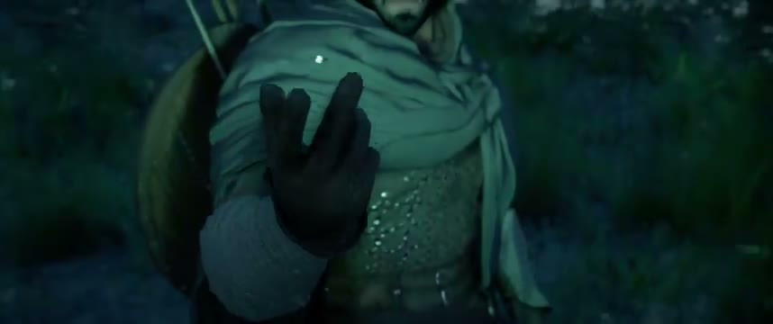
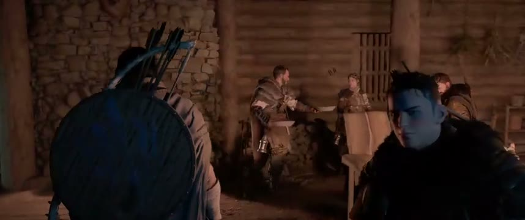

# Crimson Desert Italian Voice Mod

Doppiaggio italiano AI fan-made per **Crimson Desert**.

La mod sostituisce il package voce `0006` con audio italiano generato tramite AI. La versione pubblica attuale e' la `0.4-beta-20260528`: copre il gioco in modo ampio e giocabile, aggiunge una passata qualitativa sulle prime parti e include 220 righe recuperate che prima rischiavano di restare fuori.

> Progetto fan-made, gratuito, non ufficiale e non affiliato a Pearl Abyss. Non vendere, non caricare dietro paywall e non monetizzare il pacchetto.

## Preview video v0.4

La `0.4` non e' esente da difetti, ma i video mostrano il livello attuale della localizzazione: il gioco e' giocabile in italiano e continuera' a migliorare con correzioni su accento, ritmo, emozioni, volume e frasi problematiche.

| Preview | Cosa mostra | Guarda |
| --- | --- | --- |
|  | Primissima parte del gioco, taglio breve. | [Guarda il video breve](https://teogsxr.github.io/Mod_Translate/voice-previews/v0.4/video-breve.html) |
|  | Primo blocco piu' lungo, fino alla scena in cui Myurdin getta Kliff nel fiume. | [Guarda il video lungo](https://teogsxr.github.io/Mod_Translate/voice-previews/v0.4/video-lungo.html) |

Ci sono oltre 51.000 linee audio: feedback precisi e contributi vocali aiutano ad arrivare molto piu' velocemente a una versione rifinita.

## Link rapidi

- [Pagina Nexus Mods](https://www.nexusmods.com/crimsondesert/mods/2741)
- [Download GitHub Releases](https://github.com/teogsxr/Mod_Translate/releases)
- [Player anteprime audio v0.4](https://teogsxr.github.io/Mod_Translate/voice-previews/v0.4/#samples)
- [Video gameplay preview v0.4](https://teogsxr.github.io/Mod_Translate/voice-previews/v0.4/#video-preview)
- [Feedback voce / audio](https://github.com/teogsxr/Mod_Translate/issues/new?template=voice-feedback.yml)
- [Archivio template voci e prompt ElevenLabs](community/voice-templates/)
- [Tool diagnostica Xbox App](tools/xbox-compatibility-diagnostic/)

## Stato del progetto

| Voce | Stato |
| --- | --- |
| Release pubblica corrente | `0.4-beta-20260528` |
| Prossima release | `0.5`, recupero massivo delle righe senza testo e altro polish |
| File voce italiani inclusi | 51.461 WEM |
| Package modificato | `0006` |
| Ultima verifica locale | 28/05/2026 |
| Versione Steam verificata | buildid `23374070`, `CrimsonDesert.exe` `1.0.0.1492` |
| Ultimo aggiornamento Steam rilevato | 24/05/2026 11:09 +02:00 |

## Compatibilità

| Piattaforma | Stato |
| --- | --- |
| Steam | Supportata e testata |
| Epic / GOG / altri store | Non ancora verificati |
| Xbox App / Microsoft Store | Bloccata per sicurezza in attesa di log |

Se usi una versione non Steam, prova solo se sai ripristinare i file del gioco e apri una Issue con piattaforma, versione e log. Per Xbox App/Microsoft Store usa il tool in `tools/xbox-compatibility-diagnostic/`: non installa la mod e non modifica il gioco.

## Installazione da GitHub

Scarica il pacchetto dalla sezione **Releases** o dalla pagina Nexus Mods.

1. Scarica `CrimsonDesert_ItalianVoiceMod_GITHUB_READY_v0.4_20260528.zip`.
2. Estrai lo zip in una cartella normale del PC.
3. Avvia `CONTROLLA_PRIMA.cmd`.
4. Avvia `INSTALLA_MOD_VOCI_ITALIANE.cmd`.

Il pacchetto GitHub include Python portatile in `installer/python`, quindi non richiede Python installato nel sistema.

Nota upgrade da `0.3` / `0.3.1`: prima di installare la `0.4` e' consigliato ripristinare o cancellare gli archivi `0006` gia patchati, poi farli riscaricare/verificare da Steam. La `0.4` lascia volutamente alcune urla e battute brevi nella voce originale inglese perche risultano piu naturali: partire da una base pulita evita che restino vecchie voci AI della `0.3` in quei punti.

## Versioning

La repository `main` contiene documentazione, strumenti, anteprime, template voce e storico tecnico. Non e' il metodo consigliato per installare la mod.

I pacchetti installabili vengono pubblicati come asset nelle [GitHub Releases](https://github.com/teogsxr/Mod_Translate/releases) e su Nexus Mods. Ogni release usa:

- tag GitHub: `vMAJOR.MINOR-label-YYYYMMDD`, per esempio `v0.4-beta-20260528`;
- zip GitHub: `CrimsonDesert_ItalianVoiceMod_GITHUB_READY_vMAJOR.MINOR_YYYYMMDD.zip`;
- zip Nexus: `CrimsonDesert_ItalianVoiceMod_NEXUS_SAFE_vMAJOR.MINOR_YYYYMMDD.zip`.

La cartella `CrimsonDesert_ItalianVoiceMod_GITHUB_READY_v0.4_20260528` resta visibile nella root della repository per chi vuole navigare i file senza scaricare lo zip. Per l'installazione normale resta consigliato usare lo zip nella sezione Releases o su Nexus Mods.

Le cartelle vecchie restano in `legacy/packages/` e servono solo come storico.

## Qualità e limiti

Questa è una beta AI ampia e giocabile, non un doppiaggio professionale completo.

Le prime versioni sono state generate in massa per ottenere rapidamente una base italiana. Alcune battute possono ancora avere:

- accento inglese o straniero;
- ritmo non perfetto o lipsync impreciso;
- enfasi troppo piatta o troppo teatrale;
- volume non sempre uniforme;
- pronunce da correggere;
- personaggi secondari con voci non ancora definitive.

La versione `0.4` migliora progressivamente le parti piu' visibili: prologo, personaggi principali, antagonisti, mercanti, guardie e scene emotive. Il recupero massivo delle righe senza testo e' gia preparato ma viene spostato alla `0.5`, per non pubblicare una passata troppo automatica senza controllo.

## Anteprime audio v0.4

Le anteprime pubblicate non sono file da installare nel gioco: servono per far ascoltare e vedere la direzione della nuova passata audio e raccogliere feedback su tono, accento, emozione e coerenza dei personaggi.

- [Apri il player audio/video v0.4](https://teogsxr.github.io/Mod_Translate/voice-previews/v0.4/)
- [Vai alla cartella delle anteprime](community/voice-previews/v0.4-work-in-progress#sample-per-personaggio)

## Contribuire con feedback

I feedback più utili sono concreti e verificabili. Quando segnali un problema, se possibile indica:

- personaggio;
- scena o quest;
- frase pronunciata;
- cosa non funziona, per esempio accento, parola sbagliata, voce troppo diversa, finale troncato, volume, ritmo o emozione;
- piattaforma usata, se riguarda compatibilità.

Apri una Issue con il template [Feedback voce / audio](https://github.com/teogsxr/Mod_Translate/issues/new?template=voice-feedback.yml).

## Contribuire con voci ElevenLabs

Puoi aiutare proponendo voci o prompt per personaggi specifici. I prompt già usati sono raccolti in [community/voice-templates](community/voice-templates/), così le voci possono essere ricreate anche se vengono cancellate da ElevenLabs.

Se proponi una voce, allega:

- personaggio a cui è destinata;
- prompt usato per crearla;
- impostazioni principali, se le hai cambiate;
- file audio di preview o link;
- nota sul tono desiderato, per esempio protagonista avventuroso, anziano roco, antagonista profondo, soldato giovane, mercante o guardia.

## Nexus Mods

La variante Nexus è più prudente rispetto a quella GitHub: non include Python portatile e richiede Python 3 installato sul PC. Questa scelta riduce falsi positivi antivirus e problemi di scansione del portale.

Pagina Nexus: https://www.nexusmods.com/crimsondesert/mods/2741

## Supporto al progetto

Il progetto resta gratuito e andrà avanti anche senza donazioni. Le eventuali donazioni vengono usate per acquistare crediti AI e migliorare più velocemente il pacchetto.

  

## Uso non commerciale

Questa mod è gratuita e non a scopo di lucro. Gli audio sono generati con AI e derivano o sono condizionati dalle voci originali del gioco. Non vendere il pacchetto, non metterlo dietro paywall e non monetizzarlo.
