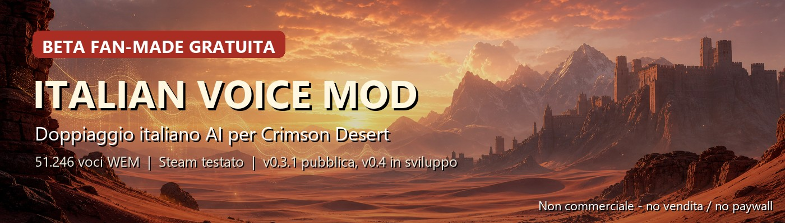

# Crimson Desert Italian Voice Mod

Doppiaggio italiano AI fan-made per **Crimson Desert**.

La mod sostituisce il package voce `0006` con audio italiano generato tramite AI. La versione pubblica attuale copre il gioco in modo ampio e giocabile, mentre la prossima versione `0.4` è in lavorazione con un approccio più curato: voci dedicate, correzioni manuali, ElevenLabs per le scene importanti e modelli locali per accelerare la copertura.

> Progetto fan-made, gratuito, non ufficiale e non affiliato a Pearl Abyss. Non vendere, non caricare dietro paywall e non monetizzare il pacchetto.

## Link rapidi

- [Pagina Nexus Mods](https://www.nexusmods.com/crimsondesert/mods/2741)
- [Player anteprime audio v0.4](https://teogsxr.github.io/Mod_Translate/voice-previews/v0.4/)
- [Feedback voce / audio](https://github.com/teogsxr/Mod_Translate/issues/new?template=voice-feedback.yml)
- [Archivio template voci e prompt ElevenLabs](community/voice-templates/)
- [Tool diagnostica Xbox App](tools/xbox-compatibility-diagnostic/)

## Stato del progetto

| Voce | Stato |
| --- | --- |
| Release pubblica corrente | `0.3.1-compat-20260527` |
| Prossima release | `0.4`, in sviluppo |
| File voce italiani inclusi | 51.246 WEM |
| Package modificato | `0006` |
| Ultima verifica locale | 28/05/2026 |
| Versione Steam verificata | buildid `23374070`, `CrimsonDesert.exe` `1.0.0.1492` |
| Ultimo aggiornamento Steam rilevato | 24/05/2026 11:09 +02:00 |

## Compatibilità

| Piattaforma | Stato |
| --- | --- |
| Steam | Supportata e testata |
| Epic / GOG / altri store | Non ancora verificati |
| Xbox App / Microsoft Store | Bloccata per sicurezza in attesa di log |

Se usi una versione non Steam, prova solo se sai ripristinare i file del gioco e apri una Issue con piattaforma, versione e log. Per Xbox App/Microsoft Store usa il tool in `tools/xbox-compatibility-diagnostic/`: non installa la mod e non modifica il gioco.

## Installazione da GitHub

Al momento i file sono pubblicati nella repository. La sezione **Releases** verrà usata quando ci sarà un pacchetto ufficiale più stabile.

1. Scarica la repository.
2. Apri `CrimsonDesert_ItalianVoiceMod_GITHUB_READY_v0.2_20260524`.
3. Avvia `CONTROLLA_PRIMA.cmd`.
4. Avvia `INSTALLA_MOD_VOCI_ITALIANE.cmd`.

Il pacchetto GitHub include Python portatile in `installer/python`, quindi non richiede Python installato nel sistema.

## Qualità e limiti

Questa è una beta AI ampia e giocabile, non un doppiaggio professionale completo.

Le prime versioni sono state generate in massa per ottenere rapidamente una base italiana. Alcune battute possono ancora avere:

- accento inglese o straniero;
- ritmo non perfetto o lipsync impreciso;
- enfasi troppo piatta o troppo teatrale;
- volume non sempre uniforme;
- pronunce da correggere;
- personaggi secondari con voci non ancora definitive.

La versione `0.4` sta migliorando progressivamente le parti più visibili: prologo, personaggi principali, antagonisti, mercanti, guardie e scene emotive. L'obiettivo è rendere prima tutto il gioco giocabile in italiano, poi rifinire le voci una per una.

## Anteprime audio v0.4

Le anteprime pubblicate non sono file da installare nel gioco: servono per far ascoltare la direzione della nuova passata audio e raccogliere feedback su tono, accento, emozione e coerenza dei personaggi.

- [Apri il player audio v0.4](https://teogsxr.github.io/Mod_Translate/voice-previews/v0.4/)
- [Vai alla cartella delle anteprime](community/voice-previews/v0.4-work-in-progress#sample-per-personaggio)

## Contribuire con feedback

I feedback più utili sono concreti e verificabili. Quando segnali un problema, se possibile indica:

- personaggio;
- scena o quest;
- frase pronunciata;
- cosa non funziona, per esempio accento, parola sbagliata, voce troppo diversa, finale troncato, volume, ritmo o emozione;
- piattaforma usata, se riguarda compatibilità.

Apri una Issue con il template [Feedback voce / audio](https://github.com/teogsxr/Mod_Translate/issues/new?template=voice-feedback.yml).

## Contribuire con voci ElevenLabs

Puoi aiutare proponendo voci o prompt per personaggi specifici. I prompt già usati sono raccolti in [community/voice-templates](community/voice-templates/), così le voci possono essere ricreate anche se vengono cancellate da ElevenLabs.

Se proponi una voce, allega:

- personaggio a cui è destinata;
- prompt usato per crearla;
- impostazioni principali, se le hai cambiate;
- file audio di preview o link;
- nota sul tono desiderato, per esempio protagonista avventuroso, anziano roco, antagonista profondo, soldato giovane, mercante o guardia.

## Nexus Mods

La variante Nexus è più prudente rispetto a quella GitHub: non include Python portatile e richiede Python 3 installato sul PC. Questa scelta riduce falsi positivi antivirus e problemi di scansione del portale.

Pagina Nexus: https://www.nexusmods.com/crimsondesert/mods/2741

## Supporto al progetto

Il progetto resta gratuito e andrà avanti anche senza donazioni. Le eventuali donazioni vengono usate per acquistare crediti AI e migliorare più velocemente il pacchetto.

  

## Uso non commerciale

Questa mod è gratuita e non a scopo di lucro. Gli audio sono generati con AI e derivano o sono condizionati dalle voci originali del gioco. Non vendere il pacchetto, non metterlo dietro paywall e non monetizzarlo.
