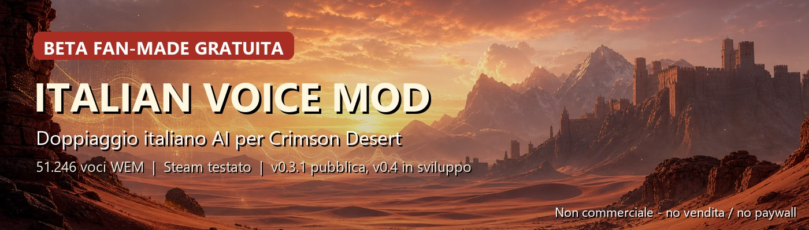
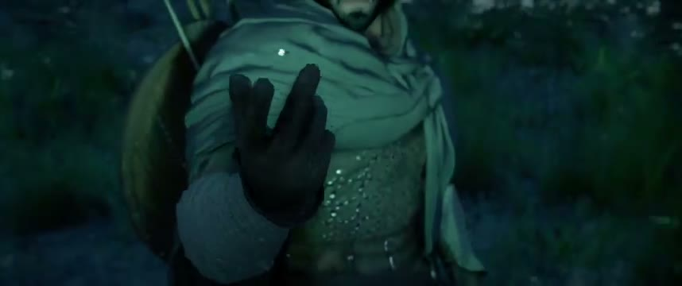
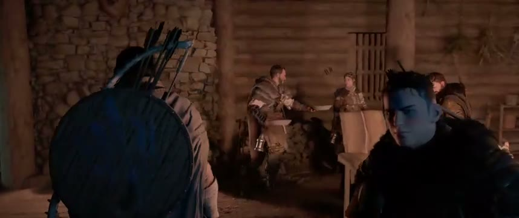

# Crimson Desert Italian Voice Mod

Doppiaggio italiano AI fan-made per **Crimson Desert**.

La mod sostituisce il package voce `0006` con audio italiano generato e ricostruito tramite una pipeline ibrida AI/local/cloud. La `0.5` corrente e' una base giocabile ripulita: mantiene la copertura ampia della `0.4`, recupera le versioni precedenti dove suonavano meglio e usa i fix `0.5` solo nei punti in cui migliorano davvero voce, urli, timing o coerenza.

La priorita di questa build non e' promettere un doppiaggio professionale completo su 51k+ linee, ma dare al gioco una localizzazione italiana ascoltabile e stabile, con personaggi principali e scene visibili trattati con piu attenzione.

> Progetto fan-made, gratuito, non ufficiale e non affiliato a Pearl Abyss. Non vendere, non caricare dietro paywall e non monetizzare il pacchetto.

## Link rapidi

- [Pagina Nexus Mods](https://www.nexusmods.com/crimsondesert/mods/2741)
- [Download GitHub Releases](https://github.com/teogsxr/Mod_Translate/releases)
- [Aggiornamento sviluppo v0.5](community/UPDATE_2026-06-04.md)
- [Feedback voce / audio](https://github.com/teogsxr/Mod_Translate/issues/new?template=voice-feedback.yml)
- [Archivio template voci e prompt ElevenLabs](community/voice-templates/)
- [Tool diagnostica Xbox App](tools/xbox-compatibility-diagnostic/)
- [Player anteprime audio/video v0.4](https://teogsxr.github.io/Mod_Translate/voice-previews/v0.4/)

## Stato del progetto

| Voce | Stato |
| --- | --- |
| Release corrente | `0.5-beta` |
| File voce italiani nel payload | 51.461 WEM |
| Package voce modificato | `0006` |
| Piattaforma test principale | Steam |
| Versione Steam verificata | buildid `23374070`, `CrimsonDesert.exe` `1.0.0.1492` |
| Pacchetto GitHub 0.5 | payload live refresh `20260604` presente nella repository |
| Pacchetto Nexus-safe 0.5 | preparato separatamente dal gioco live `20260604` |
| Xbox App / Microsoft Store | non garantita, in attesa di test/log |

## Delta release

| Confronto | Risultato |
| --- | ---: |
| Backup originale inglese `0006` | 55.586 file |
| Payload v0.4 | 51.461 WEM italiani |
| Payload v0.5 | 51.461 WEM italiani |
| Backup originale -> v0.4 | 51.461 WEM diversi |
| v0.4 -> v0.5 live `20260604` | 9.149 WEM cambiati |
| Backup originale -> v0.5 | 51.461 WEM diversi |
| Commit tecnico 02/06/2026 | 223 WEM patchati e verificati SHA |
| Fix nomi comuni 04/06/2026 | 59 WEM patchati live fuori intro |

La `0.5` non aggiunge nuovi path al payload rispetto alla `0.4`: aggiorna audio gia presenti nel package `0006`. Il pacchetto corrente e' stato riallineato allo stato live del gioco del 04/06/2026, includendo rollback selettivi, fix voce/personaggio, volantini, avvisi/testi letti e il fix dei nomi comuni fuori intro.

## Stato voci 0.5

La `0.5` distingue tra voci stabilizzate e copertura italiana provvisoria. Alcune voci sono state riportate alla versione precedente perche risultavano piu naturali della nuova generazione.

| Area / personaggio | Stato 0.5 | Nota |
| --- | --- | --- |
| Kliff | Stabilizzato | Base calma recuperata dalla 0.4; urli, comandi urgenti e alcune battute emotive mantenute dalla 0.5 dove funzionano meglio. |
| Myurdin | Stabilizzato | Recuperato dalla base 0.4, considerata piu coerente nello stato attuale. |
| Oongka | Stabilizzato | Base 0.4 con urli/comandi 0.5 dove rendono meglio. |
| Alustin / eremita | Voce 0.5 approvata | Usata come riferimento per le scene in cui il personaggio deve sembrare piu solenne. |
| Strega Bianca / White Crow | Voce 0.5 approvata | Mantenuta nello stato corrente. |
| Carl e soldati generici dell'intro | Stabilizzati su base 0.4 | Evitato di sostituirli con generazioni piu deboli. |
| Ibano / Aveeno e alcuni nomi comuni | Parzialmente sistemati | Applicati fix di coerenza voce dove esistevano sorgenti sicure; altri casi restano da trattare. |
| Yann, Nairah, Dwayne, Marius, Sebastian, Andrew, venditori, guardie e molti NPC secondari | Copertura italiana / in revisione | L'audio e' in italiano e giocabile, ma non tutte le voci sono definitive o rifinite personaggio per personaggio. |

In pratica: la mod e' giocabile e copre moltissimo testo, ma non ogni battuta ha ancora voce, emozione, volume e timing da produzione finale.

## Nuovo approccio 0.5

La `0.5` non tratta piu tutte le 51k linee come semplici frasi TTS. La pipeline decide caso per caso se:

- tenere l'audio esistente;
- mantenere l'originale per vocalizzazioni non linguistiche;
- riparare loudness, tail, fade o volume;
- ricostruire timing, pause e respiri;
- rigenerare con template voce corretto;
- segnare una riga per fix sottotitoli se il testo audio e' stato adattato.

Le priorita sono: voce corretta, pronuncia, emozione, volume coerente, assenza di effetto radio, finali vocalici non troncati e testo coerente con la scena. Il timing viene mantenuto il piu possibile, ma non deve peggiorare recitazione e comprensibilita.

## Preview video v0.4

I video v0.4 restano utili per capire la direzione generale della localizzazione. La `0.5` migliora la pipeline e aggiorna il payload, ma resta una beta in sviluppo.

| Preview | Cosa mostra | Guarda |
| --- | --- | --- |
|  | Primissima parte del gioco, taglio breve. | [Guarda il video breve](https://teogsxr.github.io/Mod_Translate/voice-previews/v0.4/video-breve.html) |
|  | Primo blocco piu lungo, fino alla scena in cui Myurdin getta Kliff nel fiume. | [Guarda il video lungo](https://teogsxr.github.io/Mod_Translate/voice-previews/v0.4/video-lungo.html) |

## Compatibilita

| Piattaforma | Stato |
| --- | --- |
| Steam | Supportata e testata |
| Epic / GOG / altri store | Non ancora verificati |
| Xbox App / Microsoft Store | Bloccata/non garantita finche non arrivano test affidabili |

Se usi una versione non Steam, prova solo se sai ripristinare i file del gioco e apri una Issue con piattaforma, versione e log. Per Xbox App/Microsoft Store usa il tool in `tools/xbox-compatibility-diagnostic/`: non installa la mod e non modifica il gioco.

## Installazione da GitHub

Scarica il pacchetto dalla sezione **Releases** o dalla pagina Nexus Mods.

1. Scarica lo zip della release piu recente.
2. Estrai lo zip in una cartella normale del PC.
3. Avvia `CONTROLLA_PRIMA.cmd`.
4. Avvia `INSTALLA_MOD_VOCI_ITALIANE.cmd`.

Il pacchetto GitHub include Python portatile in `installer/python`, quindi non richiede Python installato nel sistema.

Nota upgrade: se arrivi da una versione precedente e senti voci vecchie in punti che dovrebbero essere originali o aggiornati, ripristina/verifica da Steam gli archivi `0006` prima di reinstallare. Alcune righe vengono lasciate originali apposta quando l'originale funziona meglio di una generazione AI.

## Versioning

La repository `main` contiene documentazione, strumenti, anteprime, template voce e storico tecnico. Non e' il metodo consigliato per installare la mod.

I pacchetti installabili vengono pubblicati come asset nelle [GitHub Releases](https://github.com/teogsxr/Mod_Translate/releases) e su Nexus Mods. Ogni release usa:

- tag GitHub: `vMAJOR.MINOR-label-YYYYMMDD`, per esempio `v0.5-beta-20260604`;
- zip GitHub: `CrimsonDesert_ItalianVoiceMod_GITHUB_READY_vMAJOR.MINOR_YYYYMMDD.zip`;
- zip Nexus: `CrimsonDesert_ItalianVoiceMod_NEXUS_SAFE_vMAJOR.MINOR_YYYYMMDD.zip`.

## Qualita e limiti

Questa e' una beta AI ampia e giocabile, non un doppiaggio professionale completo. Alcune battute possono ancora avere:

- accento inglese o straniero;
- ritmo non perfetto o lipsync impreciso;
- enfasi troppo piatta o troppo teatrale;
- volume non sempre uniforme;
- pronunce da correggere;
- sottotitoli non ancora riallineati dove il testo audio e' stato adattato;
- personaggi secondari con voci non ancora definitive.

La direzione futura sara personaggio per personaggio: template voce/emozione corretti, generazione controllata, QA automatica, fix sottotitoli dove serve e test in gioco.

## Costi AI e ritmo del progetto

Questa mod e' gratuita, ma generare e verificare migliaia di linee con AI ha un costo reale in crediti, tempo e test in gioco. Al momento il progetto ha un pubblico piccolo, quindi la 0.5 resta soprattutto una base italiana giocabile e la rifinitura premium andra avanti in modo mirato: priorita alle scene importanti, ai personaggi principali e ai feedback concreti ricevuti dagli utenti.

Se la community mostra interesse, segnala bug audio o contribuisce con test e voci, diventa molto piu sensato investire altri crediti AI per migliorare progressivamente il doppiaggio.

## Feedback che posso usare per correggere

I feedback piu utili sono concreti e verificabili. Apri una Issue con il template [Feedback voce / audio](https://github.com/teogsxr/Mod_Translate/issues/new?template=voice-feedback.yml) e indica:

- versione mod usata;
- piattaforma/store;
- personaggio;
- scena o quest;
- frase pronunciata o sottotitolo a schermo;
- cosa non funziona: pronuncia, voce, volume, emozione, finale troncato, frase inglese rimasta, sottotitolo non allineato;
- come dovrebbe suonare.

I feedback verranno raccolti in una coda operativa. Prima di applicare fix nel gioco, li trasformo in un piano tecnico e li approvo con l'autore della mod.

## Contribuire con voci ElevenLabs

Puoi aiutare proponendo voci o prompt per personaggi specifici. I prompt gia usati sono raccolti in [community/voice-templates](community/voice-templates/), cosi le voci possono essere ricreate anche se vengono cancellate da ElevenLabs.

Se proponi una voce, allega:

- personaggio a cui e' destinata;
- prompt usato per crearla;
- impostazioni principali, se le hai cambiate;
- file audio di preview o link;
- nota sul tono desiderato.

## Nexus Mods

La variante Nexus e' piu prudente rispetto a quella GitHub: non include Python portatile e richiede Python 3 installato sul PC. Questa scelta riduce falsi positivi antivirus e problemi di scansione del portale.

Pagina Nexus: https://www.nexusmods.com/crimsondesert/mods/2741

## Supporto al progetto

Il progetto resta gratuito e andra avanti anche senza donazioni. Le eventuali donazioni vengono usate per acquistare crediti AI e migliorare piu velocemente il pacchetto.

  

## Uso non commerciale

Questa mod e' gratuita e non a scopo di lucro. Gli audio sono generati con AI e derivano o sono condizionati dalle voci originali del gioco. Non vendere il pacchetto, non metterlo dietro paywall e non monetizzarlo.
